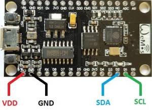
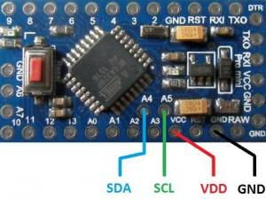
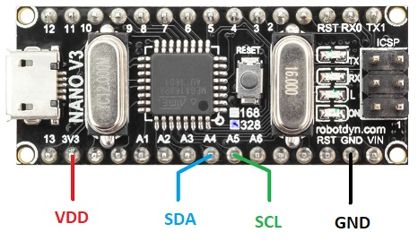
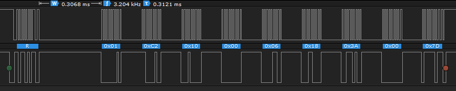

# iAQcore
Arduino library for the iAQ-core indoor air quality sensor module with I2C interface from ams.

## Introduction
This project is an Arduino *library*. It implements a driver for the iAQcore.
This chip is a indoor air quality sensor module with an I2C interface.

The code has been tested with
 - [NodeMCU (ESP8266)](https://www.aliexpress.com/item/NodeMCU-V3-Lua-WIFI-module-integration-of-ESP8266-extra-memory-32M-flash-USB-serial-CP2102/32779738528.html)
 - [Arduino pro mini](https://www.aliexpress.com/item/ProMini-ATmega328P-3-3V-Compatible-for-Arduino-Pro-Mini/32525927539.html)
 - [Arduino nano](https://www.aliexpress.com/item/Nano-CH340-ATmega328P-MicroUSB-Compatible-for-Arduino-Nano-V3/32572612009.html)

Note that the ENS210 requires a supply voltage of 1.71V .. 3.6V.
So, 3.3V is ok, but *do not use a 5V board*.
The Nano has 3v3 supply, but runs I2C on 5V. This does seem to work.

## Links
The iAQcore is made by [ams](http://www.ams.com). This library is compatible with the following variants.
 - Find the datasheet of the iAQcore continuous on the
   [product page](http://ams.com/eng/Products/Environmental-Sensors/Air-Quality-Sensors/iAQ-core-C).
 - Find the datasheet of the iAQcore pulsed on the
   [product page](http://ams.com/eng/Products/Environmental-Sensors/Air-Quality-Sensors/iAQ-core-P).

## Prerequisites
It is assumed that
 - The Arduino IDE has been installed.
   If not, refer to "Install the Arduino Desktop IDE" on the
   [Arduino site](https://www.arduino.cc/en/Guide/HomePage).
 - The library directory is at its default location.
   For me, Maarten, that is `C:\Users\maarten\Documents\Arduino\libraries`.

## Installation
Installation steps
 - Visit the [project page](https://github.com/maarten-pennings/iAQcore) for the Arduino iAQcore library.
 - Click the green button `Clone or download` on the right side.
 - From the pop-up choose `Download ZIP`.
 - Unzip the file "Here", so that this `README.md` is in the top-level directory
   with the name `iAQcore-master`.
 - Rename the top-level directory `iAQcore-master` to `iAQcore`.
 - Copy the entire tree to the Arduino library directory.
   This `README.md` should be located at e.g.
   `C:\Users\maarten\Documents\Arduino\libraries\iAQcore\README.md`.

## Build an example
To build an example sketch
 - (Re)start Arduino.
 - Open File > Example > Examples from Custom Libraries > iAQcore > iAQcore-simple.
 - Make sure Tools > Board lists the correct board.
 - Select Sketch > Verify/Compile.

## Wiring
This library has been tested with three boards.

For the NodeMCU (ESP8266), connect as follows (I did not use pull-ups, presumably they are inside the MCU)

| ENS210 | ESP8266 |
|:------:|:-------:|
|   VDD  |   3V3   |
|   GND  |   GND   |
|   SDA  |   D2    |
|   SCL  |   D1    |



For the Pro mini (do *not* use a 5V board), connect as follows  (I did not use pull-ups, presumably they are inside the MCU)

| ENS210 | Pro mini |
|:------:|:--------:|
|   VDD  |   VCC    |
|   GND  |   GND    |
|   SDA  |    A4    |
|   SCL  |    A5    |



For the Arduino Nano, connect as follows  (I did not use pull-ups, presumably they are inside the MCU)

| ENS210 |   Nano   |
|:------:|:--------:|
|   VDD  |   3V3    |
|   GND  |   GND    |
|   SDA  |    A4    |
|   SCL  |    A5    |



## Flash an example
To build an example sketch
 - (Re)start Arduino.
 - Open File > Example > Examples from Custom Libraries > iAQcore > iAQcore-simple.
 - Alternatively open File > Example > Examples from Custom Libraries > iAQcore > iAQcore-full.
 - In `setup()` make sure to start the I2C driver correctly.
   For example, for ESP8266 NodeMCU have
     ```C++
     // Enable I2C for ESP8266 NodeMCU boards [VDD to 3V3, GND to GND, SDA to D2, SCL to D1]
     Wire.begin(D2,D1); 
     Wire.setClockStretchLimit(1000); 
     ```
   and for Arduino pro mini or Nano have
     ```C++
     // Enable I2C for Arduino pro mini or Nano [VDD to VCC/3V3, GND to GND, SDA to A4, SCL to A5]
     Wire.begin(); 
     ```
 - Make sure Tools > Board lists the correct board.
 - Select Sketch > Upload.
 - Select Tools > Serial Monitor.
 - Enjoy the output, which should be like this for `iAQcore-simple`:

     ```Text
     Starting ENS210 simple demo
     19.9 C, 59 %RH
     23.1 C, 79 %RH
     23.1 C, 79 %RH
     27.7 C, 94 %RH
     26.5 C, 95 %RH
     23.5 C, 94 %RH
     21.1 C, 94 %RH
     20.2 C, 94 %RH
     20.1 C, 94 %RH
     19.4 C, 87 %RH
     19.3 C, 79 %RH
     19.3 C, 68 %RH
     ```

##Clock stretching
I2C _slave_ devices, such as the iAQcore, are controlled by I2C _masters_, such as the ESP8266, pro mini or nano.
The master sends is in charge of the communication to the slave, thereby toggling the clock line (SCL) high and low.
Each clock pulse one bit is transferred between the master and the slave (from or to).
If the slave is not yet ready, it may _stretch the clock_.

The figure below shows that after the master has send the address byte of the iAQcore, this iAQcore chip
stretches the SCL line for 306.8 us. 



Unfortunately, the ESP8266 I2C library has a clock stretch timeout of 230us.
So, this timeout must be set to a higher value: `Wire.setClockStretchLimit(1000)`.

(end of doc)
